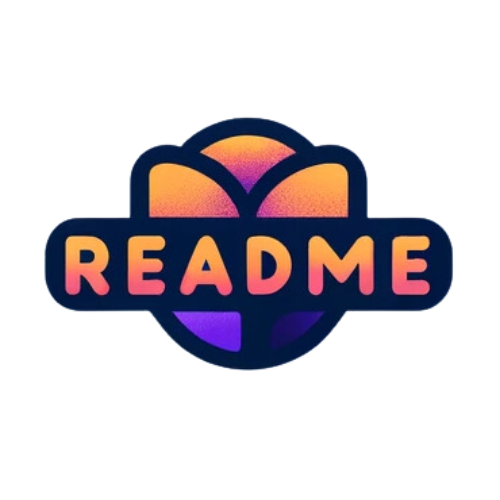

<p align="center">
    
</p>

<p align="center">
<b>Este repositório fornece uma série de modelos de README para ajudar os desenvolvedores a documentarem seus projetos 🚀👩‍💻</b>
</p>

_Leia isso em outros idiomas:_
[_Inglês_](./../README.md),
<!-- [_Español_](README.es-ES.md), -->

<h2 id="templates">📝 Modelos</h2>

<div>

[SIMPLE_FRONT__BADGE]: https://img.shields.io/badge/Frontend_Simples-000?style=for-the-badge&logo=html
[SIMPLE_BACK__BADGE]: https://img.shields.io/badge/Backend_Simples-000?style=for-the-badge&logo=code
[BADGES_FRONT__BADGE]: https://img.shields.io/badge/Frontend_Com_Badges-000?style=for-the-badge&logo=badge
[BADGES_BACK__BADGE]: https://img.shields.io/badge/Backend_Com_Badges-000?style=for-the-badge&logo=badge

[![backend-simples][SIMPLE_BACK__BADGE]](./../simple/backend.md)
[![frontend-simples][SIMPLE_FRONT__BADGE]](./../simple/frontend.md)
[![frontend-badges][BADGES_FRONT__BADGE]](./../badges/frontend.md)
[![backend-badges][BADGES_BACK__BADGE]](./../badges/backend.md)

</div>

<h2 id="contribuir">Contribuir 🚀</h2>

Se você quiser contribuir, clone este repositório, crie sua própria branch de trabalho e mãos à obra!

```bash
git clone https://github.com/Fernanda-Kipper/Readme-Templates.git
```

```bash
git checkout -b feature/NOME
```
No final, abra um Pull Request explicando o problema resolvido ou a funcionalidade adicionada. Se existir, adicione capturas de tela das modificações visuais e aguarde pela revisão!

[Como criar um Pull Request](https://www.atlassian.com/br/git/tutorials/making-a-pull-request) |
[Padrão de commits](https://gist.github.com/joshbuchea/6f47e86d2510bce28f8e7f42ae84c716)


<h2 id="license">Licença  📃 </h2>

Este projeto está sob a licença [MIT](./../LICENSE) license
